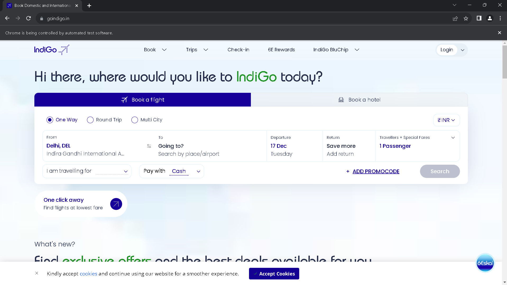
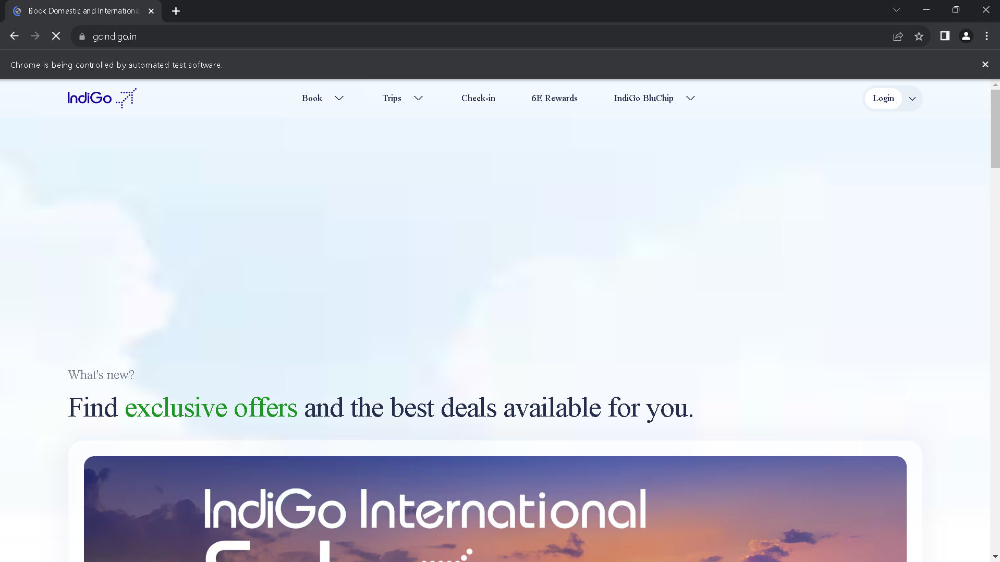

# Indigo-Website-Automation
A Selenium-based project to test and validate functionalities of the Indigo Airlines website, including login, ticket booking, and navigation workflows.
## Features

- Automated testing of the login process.
- Validation of ticket booking workflows.
- Navigation testing of core website sections.

## Technologies Used
- Python
- Selenium
- Chrome WebDriver

### Demo Video
This screen recording shows the automation script performing:
- Login to the Indigo Airlines portal.
- Navigation through website sections.
- select the number of persons.
- Booking a test ticket (mock data).

### Demo

